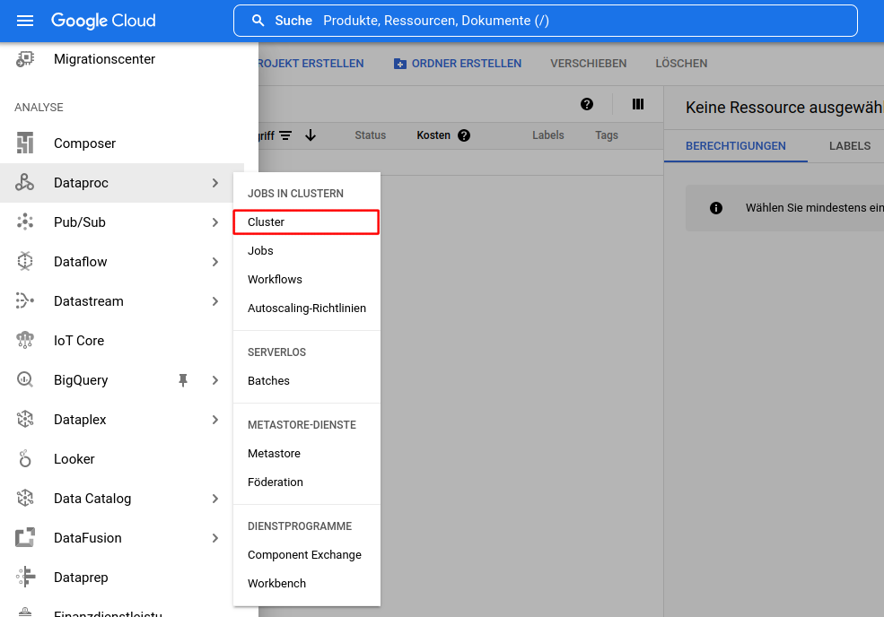

# Spark Cluster aufsetzen

Spark kann lokal auf einem Computer installiert werden. Dies ist vor allem nützlich um Skripte zu erstellen und zu testen. Anschliessend können die lokal entwickelten Skripte unverändert auf einem Cluster ausgeführt werden.

Hier stellen wir verschiedene Möglichkeiten vor, wie Spark aufgesetzt werden kann, lokal und in einem Cluster in der Cloud.


## Lokales Cluster aufsetzen

Diese Instruktionen beziehen sich auf grundsätzlich auf Ubuntu, können aber sinngemäss auf andere OS übertragen werden. Apache Spark ist eine Java-Applikation, kann also relativ einfach zum Laufen gebracht werden sofern Java verfügbar ist.

Auf Cloud-Servern werden wir in den allermeisten Fällen auf Linux treffen, und dabei ist Ubuntu eine häufige Wahl, und gerade für Anfänger gut geeignet.


### 1. Java Runtime installieren

Spark benötigt Java, wir müssen also sicherstellen dass es installiert ist. Wir können die Java-Version im Terminal überprüfen:

```bash
java -version
```

Falls nötig, kann Java und das JDK installiert werden:

```bash
sudo apt update
sudo apt install default-jre default-jdk
```

### 2. Spark herunterladen und installieren

Wir installieren Spark im Ordner `/opt/spark`. Der aktuelle Download-Link kann auf der Seite [https://spark.apache.org/downloads.html](https://spark.apache.org/downloads.html) gefunden werden.

```bash
wget https://dlcdn.apache.org/spark/spark-3.5.0/spark-3.5.0-bin-hadoop3.tgz
```

Anschliessend müssen wir das Archiv extrahieren und anschliessend den Ordner nach `/opt/spark` verschieben:

```bash
tar xvf spark-3.5.0-bin-hadoop3.tgz
sudo mv spark-3.5.0-bin-hadoop3 /opt/spark
```

Wir sollten nun noch die Umgebungsvariable `SPARK_HOME` unserer Shell definieren.

Idealerweise fügen wir den Installationsordner auch noch der Umgebungsvariable `PATH` hinzu, im Falle von Bash z.B. in der Datei `.bash_profile` oder `.bashrc`:

```bash
export SPARK_HOME=/opt/spark
export PATH=$PATH:$SPARK_HOME/bin:$SPARK_HOME/sbin
```


### 3. Spark Master-Server starten

Nun kann der Standalone-Master-Server gestartet werden:

```bash
start-master.sh
```

oder, falls die PATH-Variable nicht angepasst wurde:

```bash
/opt/spark/start-master.sh
```

Die Spark Master Webseite ist dann auf der URL [http://localhost:8080](http://localhost:8080) verfügbar.

Die Spark-URL wird gebraucht um die Worker-Prozesse zu starten. Sie ist auf der Master Webseite einsehbar. Sie startet mit `spark://`, z.B. [spark://computer/7077](spark://computer:7077) falls der Computer `computer` heisst.


### 4. Worker-Prozess starten

Wir können anschliessend einfach einen Worker-Prozess starten:

```bash
start-worker.sh spark://computer:7077
```


### 5. PySpark installieren

Apache Spark kann grundsätzlich in verschiedenen Programmiersprachen angesprochen werden. Dabei ist Scala die Hauptsprache, aber wir können auch Python- oder R-Skripts verwenden.

In unserem Fall fokussieren wir auf Python-Skripts. Dazu benötigen wir die Bibliothek PySpark.

PySpark ist grundsätzlich Teil der Spark-Installation und kann einfach mit `pyspark` vom Terminal aus gestartet werden (sofern sich das `pyspark`-Programm im `PATH` befindet).

PySpark kann aber auch unabhängig von Spark installiert werden. In diesem Fall ist auch eine lokale Installation nicht erforderlich. Wenn wir mit PySpark anfangen zu arbeiten, werden wir eine Spark-Session erstellen, die dann auch die Information enthält, auf welchem Spark-Cluster das Skript laufen soll.

In diesem Fall kann PySpark einfach mit `pip` installiert werden:

```bash
pip install pyspark
```

oder natürlich auch mit Anaconda:

```bash
conda install -c conda-forge pyspark
```

Idealerweise setzen wir vorher natürlich noch ein Virtualenv oder ähnlich auf.


### 6. Spark Cluster stoppen

Am Ende sollten wir das Cluster wieder stoppen:

```bash
stop-worker.sh
stop-master.sh
```


## Multi-Node Spark Cluster in Google Cloud aufsetzen

Cloud-basierte Spark Cluster können in allen grossen Cloud-Umgebungen erstellt werden, und auch in einigen kleineren, meist spezialisierten Clouds.

In diesem Fall benutzen wird die Cloud von Google.

**Achtung:** Das Erstellen eines Spark Clusters bei einem Cloud-Provider ist kostenpflichtig. Die meisten Cloud-Provider geben jedoch einen gewissen Anfangskredit.

Als Erstes müssen wir uns bei Google Cloud anmelden. Falls noch kein Projekt besteht muss zuerst eines erstellt werden.

Danach können wir ein neues Cluster erstellen. Dies geschieht indem wir in der Liste der Services im Menüpunkt **Dataproc** die Option **Cluster** auswählen (der Menüpunkt befindet sich in der Sektion Analyse, ziemlich weit unten in der Liste der Services):



Ein Dataproc Cluster basiert auf Hadoop und erlaubt die Ausführung von Spark und anderen Frameworks.

Der Service muss beim ersten Mal aktiviert werden. Danach können wir ein neues Cluster erstellen. Wir haben die Wahl zwischen Compute Engine und Kubernetes Engine (GKE). Wählen wir Compute Engine.

Dabei müssen wir dem Cluster einen **Namen** geben.

Die **Region** und Zone kann auch ausgewählt werden. Dabei ist `europe-west3` das Datencenter in Frankfurt, und `europe-west6` jenes in Zürich.

Als **Clustertype** wählen wir *Standard*.

Unter **Versionsverwaltung** müssen wir sicherstellen dass wir die neueste Spark-Version haben. Debian als OS ist meist vorgewählt.

Unter **Komponenten** sollten wir **Component Gateway** aktivieren um über eine Weboberfläche auf das Cluster zuzugreifen.

Auch sollten wir optionale Komponenten installieren. Wir wählen **Zeppelin Notebook** ([zeppelin.apache.org](https://zeppelin.apache.org/)) aus (Port 8080). Auch **Jupyter Notebook** ist allenfalls vorhanden (Port 8123). Anaconda sollte jedoch nicht ausgewählt werden mit Spark 3.

Anschliessend müssen die **Knoten konfiguriert** werden. Dabei können wir für Lernzwecke eine einfache Konfiguration vornehmen. 

Für den **Manager-Knoten** können wir eine `n1-standard-2`-Maschine wählen (2 vCPU, 7.5 GB RAM). Die Festplatte kann reduziert werden (z.B. auf 32 GB).

Anschliessend müssen wir die **Worker-Knoten** konfigurieren. Dabei können wir einen benutzerdefinierten Maschinentyp auswählen mit 1 vCPU, 3.75 GB RAM. Wir wählen 3 Worker-Knoten mit einer Festplatte von 32 GB.

Es lohnt sich unter Umständen das planmässige Löschen des Clusters wenn es nicht mehr gebraucht wird, z.B. nach 1 Stunde Inaktivität.

Wir können auch noch einen **Storage-Bucket** auswählen um Daten permanent zu speichern. Ansonsten wird automatisch ein Bucket erstellt.

Anschliessend kann das Cluster erstellt werden. Nach ein paar Minuten ist das Cluster bereit.
